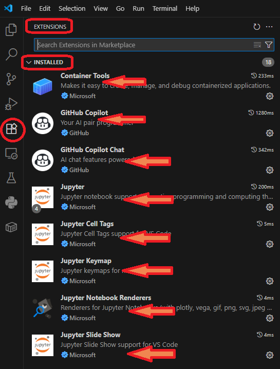

# Containerfile-jupyter-notebook
A Container image with Jupyter-Notebook. It is specially customized for Python, Pandas, Seaborn, GNU-Octave, Latex and PDF. It uses mini-conda for managing Python libraries. All conda packages are installed in Base venv.
  
Use it on a Windows/Mac or Linux Host computer. Use Docker or Podman. Any Folder can be used as Volume for Notebooks. 

## Using from Inside VSCode (with CoPilot)
This Container Image can be used from VSCode with following Extensions:
- Github Copilot (From Github)
- Github Copilot Chat (From Github)
- Container Tools (From Microsoft)
- Jupyter (From Microsoft)
- Screen shot of VSCode extensions:
    - 

## Suggestions on How to Use it with Copilot
Although this video uses a different container (and VSCode extensions) for Jupyter, but the concepts, and usage idea is similar. You can use the CoPilot interface in VSCode Extensions to help you in generation of Jupyter Notebooks.
- **<u>Attention</u>**: The Video below uses a different Container service, that may be paid, and non-free. This video is linked here only for suggesting how this free Container may also be used.
- Video Link [https://learn.microsoft.com/en-us/shows/github-copilot-series/using-copilot-with-jupyter-notebooks](https://learn.microsoft.com/en-us/shows/github-copilot-series/using-copilot-with-jupyter-notebooks)
    - [](https://www.youtube.com/watch?v=QS_bh-3qKdw)


## Download from Quay.io
- [https://quay.io/repository/hammadrauf/jupyter-notebook](https://quay.io/repository/hammadrauf/jupyter-notebook)
```
podman pull quay.io/hammadrauf/jupyter-notebook
# OR
docker pull quay.io/hammadrauf/jupyter-notebook
```

## Download from Dockerhub (Docker.io)
- [https://hub.docker.com/r/hammadrauf/jupyter-notebook](https://hub.docker.com/r/hammadrauf/jupyter-notebook)
```
docker pull docker.io/hammadrauf/jupyter-notebook
# OR
podman pull docker.io/hammadrauf/jupyter-notebook
```


## How to Launch the Container Image

You can run the container and mount a local directory for your notebooks using the following command (replace <local-notebooks-dir> with the path on your machine where you want to store notebooks):

- With Docker:
    ```
    docker run -p 8888:8888 -v <local-notebooks-dir>:/workspace/notebooks docker.io/hammadrauf/jupyter-notebook
    ```

- With Podman:
    ```
    podman run -p 8888:8888 -v <local-notebooks-dir>:/workspace/notebooks quay.io/hammadrauf/jupyter-notebook
    ```

Then open [http://localhost:8888](http://localhost:8888) in your browser, or start a *.ipynb jupyter notebook in VSCode.
  
By default, no token is required to access the Jupyter Notebook.

### Optional: Set a Jupyter Token

Jupyter Server/Notebook Supports Token for security. A Token is a HexaDecimal number. To require a token for access, set the `JUPYTER_TOKEN` environment variable:

- With Docker:
    ```
    docker run -p 8888:8888 -v <local-notebooks-dir>:/workspace/notebooks -e JUPYTER_TOKEN=yourtoken docker.io/hammadrauf/jupyter-notebook
    ```

- With Podman:
    ```
    podman run -p 8888:8888 -v <local-notebooks-dir>:/workspace/notebooks -e JUPYTER_TOKEN=yourtoken quay.io/hammadrauf/jupyter-notebook
    ```

Then open [http://localhost:8888](http://localhost:8888) in your browser and enter the token if prompted. Or start a *.ipynb jupyter notebook in VSCode.

## Sample Jupyter Notebooks
There are 5 sample Jupyter Notebooks (*.ipynb) files included. Place them in your Folder that you are mapping to Container volume /workspace/notebooks.
1. [sample-notebooks/Titanic.ipynb](./sample-notebooks/Titanic.ipynb) - Use Python Kernel for this.
1. [sample-notebooks/RunShell.ipynb](./sample-notebooks/RunShell.ipynb) - Use Python Kernel for this.
1. [sample-notebooks/Matrices_&_Determinants.ipynb](./sample-notebooks/Matrices_&_Determinants.ipynb) - Use Octave Kernel for this.
1. [sample-notebooks/Solving-Linear-Equations - with visible latex.ipynb](./sample-notebooks/Solving-Linear-Equations%20-%20with%20visible%20latex.ipynb) - Use Octave Kernel for this.
1. [sample-notebooks/Solving-Linear-Equations - with hidden latex.ipynb](./sample-notebooks/Solving-Linear-Equations%20-%20with%20hidden%20latex.ipynb) - Use Octave Kernel for this.

## Using Latex
When using Latex in your notebooks, that may eventually be converted to PDF files, make sure to use strict Latex syntax. The Latex to PDF converter used in this Container (nbconvert with xelatex) is particularly sensitive to extra 'Space' characters.
  
If you encounter error when converting a notebook to PDF make sure the Latex expressions you may have used in that notebook do not use unnecessary Spaces.
